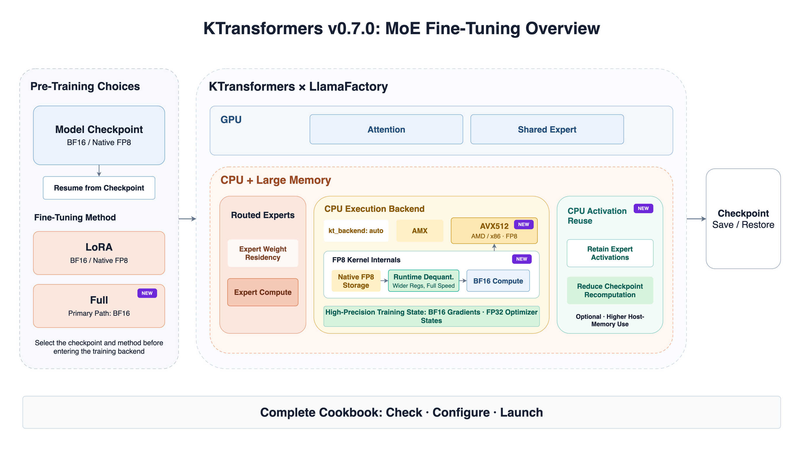

More ultra-large MoE models are now being released in FP8. Whether fine-tuning can run smoothly also depends on CPU instruction-set compatibility, system memory capacity, and the training framework's ability to read the model's original checkpoint directly.

KTransformers v0.7.0 focuses on fine-tuning: it can load native FP8 Expert weights directly for LoRA training; adds an AVX512 CPU path so compatible AMD/x86 platforms with large host memory can participate in ultra-large MoE fine-tuning; and improves full fine-tuning, training-artifact management, and the accompanying Cookbook.



## 1. Load Native FP8 Weights Directly and Halve Expert-Weight Memory

Traditional fine-tuning workflows often expand FP8 Expert weights to BF16 before training and keep the larger weight copy in system memory.

v0.7.0 supports native block-FP8 LoRA fine-tuning for DeepSeek-V3.1. E4M3 FP8 Expert weights and scales are loaded directly from the checkpoint and remain in their original FP8 format in memory. Inside the FP8 Kernel, the weights are loaded directly into BF16-width registers and used for BF16 computation. This path folds dequantization into weight loading and uses additional register width to avoid a separate dequantization stage.

The base Expert weights remain stored in FP8, halving their memory footprint relative to a complete BF16 copy. Activations, LoRA parameters, and gradients remain BF16, while optimizer states remain FP32. In the official DeepSeek-V3.1 test configuration, host-memory demand decreased from approximately 1.4 TB to about 800 GB.

> Note: Native FP8 in this release targets LoRA fine-tuning with frozen base Expert weights. Full fine-tuning primarily uses BF16.

## 2. Support Compatible AMD/x86 CPUs with AVX512

KTransformers' high-performance CPU Expert fine-tuning path previously focused on AMX-capable platforms. v0.7.0 adds an AVX512 CPU execution backend, allowing compatible AMD/x86 CPUs with the required AVX512 extensions to participate in ultra-large MoE fine-tuning.

In this heterogeneous division of work, the CPU and large host memory handle Routed Expert weight residency and computation, while the GPU runs Attention and Shared Expert modules. Use the recommended unified backend entry in the LlamaFactory training YAML:

```yaml
kt_config:
  kt_backend: auto
```

`auto` selects a backend according to the CPU capabilities and weight format.

## 3. Choose Between LoRA and Full Fine-Tuning

LoRA or Full is selected in the training configuration before execution enters the KTransformers × LlamaFactory backend. LoRA suits rapid adaptation and resource-constrained workloads. Full fine-tuning supports deeper model updates for workloads that can accommodate the higher host-memory, GPU-memory, and checkpoint costs.

Full fine-tuning updates both the CPU Expert weights managed by KTransformers and the model's ordinary trainable parameters. The workflow covers gradients, optimizer updates, multi-step training, and distributed execution. Its principal path is BF16. Both LoRA and Full training artifacts support checkpoint saving, restoration, and continued training from a checkpoint.


## 4. CPU Activation Reuse: Use Host Memory to Reduce Recalculation

v0.7.0 also provides CPU Activation Reuse. When enabled, CPU Expert activations can be retained during checkpoint recomputation.

```yaml
kt_cpu_activation: retain
```

This option uses additional host memory to reduce repeated computation. When it is not set, CPU activations follow the overall checkpoint policy.

## 5. A Complete Cookbook for Checks, Configuration, and Launch

The accompanying KTransformers × LlamaFactory MoE Fine-Tuning Cookbook first helps users choose an Expert weight option, then select LoRA or Full from the currently supported combinations. BF16 supports both LoRA and full fine-tuning. Native FP8, converted INT8, and AMXINT4 are used for LoRA with frozen base Experts.

The Cookbook also covers hardware checks, environment installation, the division of responsibilities between the training YAML and Accelerate YAML, base recipes, launch commands, resource estimates, and troubleshooting. All user-facing KTransformers settings belong in the training YAML. The Accelerate YAML contains only distributed-execution and FSDP2 settings.

For details, see the KTransformers Fine-Tuning Cookbook: https://github.com/kvcache-ai/ktransformers/blob/main/doc/en/SFT/KTransformers-Fine-Tuning_Cookbook.md

## 6. Installation and Resources

KTransformers v0.7.0 is available now. Install its fine-tuning dependencies with:

```bash
pip install "ktransformers[sft]==0.7.0"
```

The matching SFT integration packages are:

- `transformers-kt==5.6.0.post2`
- `accelerate-kt==1.14.0.post2`

Learn more:

- [KTransformers v0.7.0 Release](https://github.com/kvcache-ai/ktransformers/releases/tag/v0.7.0)
- [KTransformers Fine-Tuning Cookbook](https://github.com/kvcache-ai/ktransformers/blob/main/doc/en/SFT/KTransformers-Fine-Tuning_Cookbook.md)
- [KTransformers website](https://ktransformers.net/)
